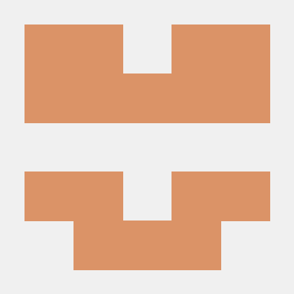
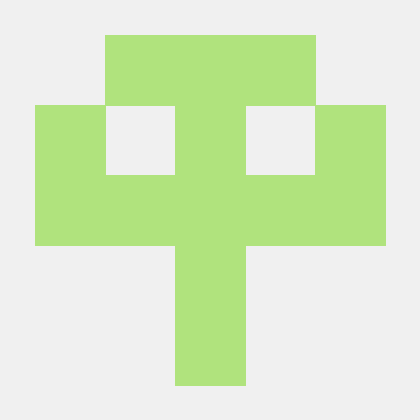
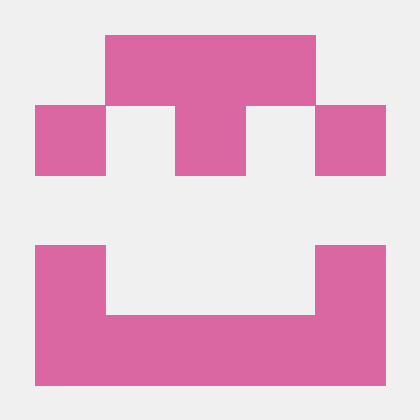
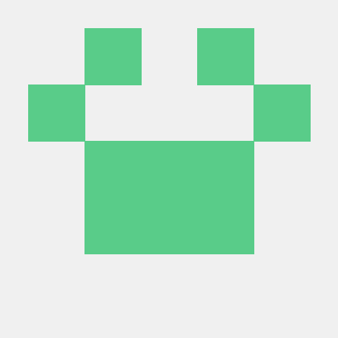
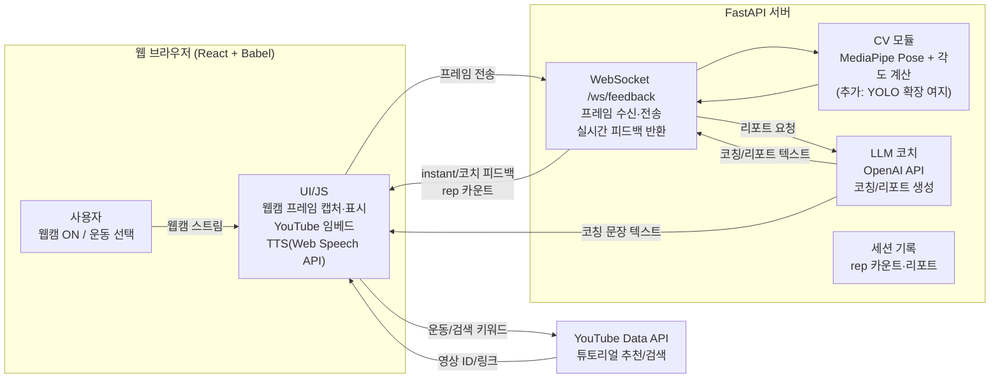

# ai01-2nd-2team-KSLNOVA
The second project of NOVA - **SQUAT COACH**

----------------------------

# 프로젝트 기획서

## 1. 프로젝트 정의
- **프로젝트 이름** : SQUAT COACH
- **목표**  
  - 브라우저에서 웹캠 캡처 → 최하단 이미지만 FastAPI REST(`/analyze-image`)로 전송해 분석  
  - 로컬 Mediapipe Pose로 스쿼트/플랭크 관절 각도·rep 카운트 및 스켈레톤/캡처 표시  
  - OpenAI API로 캡처 이미지 분석 후 한국어 피드백 생성, Web Speech API로 TTS 재생  
  - YouTube Data API로 튜토리얼 임베드, 실패 시 기본 영상으로 폴백  
  - 키는 .env → env.js로 주입, 프론트는 정적 서버(`python -m http.server 5500`)에서 동작  

- **참고/참고 논문**  
  - MediaPipe 기반 운동자세 교정 시스템의 기능 개선 연구  
  - YOLOv8·Mediapipe를 이용한 운동자세 교정 자동 피드백 시스템  
  - 실시간 동작 인식 및 자세 교정 스마트 미러 피트니스 시스템

## 2. 주요 내용
- **📅 프로젝트 기간**: 2025-12-02 ~ 2025-12-12
- **👨🏻‍👩🏻‍👧🏻‍👦🏻 팀원 소개**

<table>
  <tr>
    <th></th>
    <th>김채원</th>
    <th>손지원</th>
    <th>이주연</th>
    <th>이진배</th>
  </tr>
  <tr>
    <td></td>
    <td align="center">
      
    </td>
    <td align="center">
      
    </td>
    <td align="center">
      
    </td>
    <td align="center">
      
    </td>
  </tr>
  <tr>
    <td align="center">역할</td>
    <td align="center">팀장<br/>PM</td>
    <td align="center">Frontend</td>
    <td align="center">backend</td>
    <td align="center">backend</td>
  </tr>
<tr>
  <td align="center">담당 모듈</td>
  <td align="center">
    자세 스코어링<br/>
    TTS(Web Speech API) 제어<br/>
    텍스트→음성 변환
  </td>
  <td align="center">
    웹 UI(React)
  </td>
  <td align="center">
    MediaPipe Pose<br/>
    관절 각도 계산<br/>
  </td>
  <td align="center">
    OpenAI API 코칭/리포트<br/>
    유튜브 추천 키워드/검색
  </td>
</tr>

</table>


## 3. 일정 계획

| 작업 항목                  | 시작 날짜   | 종료 날짜   | 기간(일) |
|---------------------------|------------|------------|---------|
| 아이디어 회의               | 2025-12-02 | 2025-12-04 | 3       |
| CV                       | 2025-01-08 | 2025-01-14 | 7       |
| LLM                       | 2025-01-15 | 2025-01-21 | 7       |
| TTS                       | 2025-01-22 | 2025-01-28 | 7       |
| 피드백                      | 2025-01-29 | 2025-02-04 | 7       |
| UI                       | 2025-02-05 | 2025-02-07 | 3       |
| 프로젝트 발표               | 2025-12-12 | 2025-12-12 | 1       |

-----------------------------

# 작업 분할 구조 (WBS)

### 1. 📸 CV & 실시간 처리
- 웹캠 캡처 → 로컬 Mediapipe Pose 각도 계산 → 최하단 이미지 캡처만 REST(`/analyze-image`)로 전송
- 스쿼트/플랭크 규칙 기반 rep 카운트·instant 피드백(스켈레톤/캡처 오버레이)
- 프레임 저장/오버레이 표시(WS 사용 안 함)

### 2. 💬 LLM 코칭 & 리포트
- OpenAI API로 캡처 이미지 분석 후 한국어 피드백 생성
- 운동 선택에 따라 코칭 필터링 및 세션별 로그
- 오류 시 기본 안내로 폴백

### 3. 🗣️ TTS
- Web Speech API로 브라우저에서 음성 재생
- 발화 중복·쿨다운 제어, 음성 다시듣기

### 4. 🎬 튜토리얼/검색
- YouTube Data API로 운동별 추천 영상 검색
- API 실패 시 기본/노쿠키 영상 대체, 수동 ID/링크 입력 지원

### 5. 💻 프론트엔드 UX
- React(바닐라 JSX+CDN) 단일 페이지, 분석 뷰/튜토리얼/채팅 UI
- 운동 전환 시 상태 초기화, 키 없음·API 실패 시 안내
- env.js는 루트 .env 기반 생성, 정적 서버(`python -m http.server`)로 구동

---------------------------

# 요구사항 정의서

## 1. 기능 요구사항
- [FR-01] 브라우저에서 웹캠을 켜고 로컬 Mediapipe로 관절 좌표·각도를 계산한다(WS 미사용).
- [FR-02] 스쿼트/플랭크 규칙으로 rep 카운트·최하단 캡처를 수행하고, 스켈레톤/캡처를 UI에 표시한다.
- [FR-03] 최하단 캡처 이미지를 FastAPI REST(`/analyze-image`)로 전송해 OpenAI API 기반 피드백을 받는다.
- [FR-04] 브라우저 Web Speech API로 텍스트 피드백을 음성(TTS)으로 재생한다.
- [FR-05] YouTube Data API(또는 수동 ID/링크)로 튜토리얼 영상을 임베드하고, 실패 시 기본 영상으로 대체한다.
- [FR-06] 운동 변경 시 세션 상태(카운트/로그/피드백)를 초기화한다.
- [FR-07] API 키·엔드포인트는 `.env → env.js`로 주입해 프론트에서 사용한다.
- [FR-08] 필요 시 세션 종료 시 카메라 스트림을 정지하고, 시작 시 재요청한다.

## 2. 비기능 요구사항
- [NFR-01] 로컬 데모 기준 저지연(수백 ms~1s) 피드백을 목표로 한다.
- [NFR-02] API 키 누락/쿼터 초과 시 기본 안내·대체 영상으로 폴백한다.
- [NFR-03] 키 노출 방지를 위해 .env → env.js 생성, env.js는 Git에 포함하지 않는다.
- [NFR-04] 외부 네트워크(OpenAI/YouTube) 실패 시에도 최소한 카메라 스트림·기본 영상은 동작해야 한다.

---------------------------

# 프로젝트 설계서

## 1. 시스템 아키텍처 (현재 구현 기준)
1. **사용자(브라우저)**: 웹캠 ON, 운동 선택(스쿼트/플랭크), 튜토리얼 시청·채팅·TTS 청취  
2. **Frontend(UI)**: React(JSX/CDN) 단일 페이지, 웹캠 캡처 → WebSocket 전송, 분석 프레임/튜토리얼/채팅/TTS 표시  
3. **WebSocket 서버(FastAPI)**: `/ws/feedback`에서 프레임 수신·복호화, MediaPipe Pose로 각도·rep 계산, instant/코칭 피드백 JSON 송신  
4. **LLM 모듈(OpenAI API)**: 코칭 문구·세션 리포트 생성, 운동별로 필터링 후 프론트에 전달  
5. **튜토리얼/검색**: YouTube Data API로 추천/검색, 실패 시 기본·nocookie 영상 폴백  
6. **TTS**: 브라우저 Web Speech API, 쿨다운/중복 방지, 다시 듣기 지원  
7. **데이터/로그**: 프론트 메모리 세션(역사/rep/feedback), 선택 시 video/에 녹화 파일 저장(로컬)

## 2. 기술 스택
## 📚 TECH STACKS

**Frontend**
<p align="center">
  
  
  
  
  
</p>

**Backend**
<p align="center">
  
  
  
  
</p>

**CV / 분석**
<p align="center">
  
  
  
</p>

**운영/도구**
<p align="center">
  
  
  
</p>


## 3. 설계 이미지

---------------------------

# 데이터 연동 정의서

## 1. 데이터 정의
- 입력: 웹캠 프레임(base64 JPEG), 운동 선택(스쿼트/플랭크), 채팅 메시지  
- 출력: instant/코칭 피드백 텍스트, rep 카운트, 분석 프레임(base64 JPEG), 세션 리포트, 튜토리얼 영상 링크
- 외부 키: `OPENAI_API_KEY`, `YOUTUBE_API_KEY` (.env → env.js), 공개 저장소에 포함 금지
- 로컬 파일: `dataset/xyz_distances.csv`(참고용), `video/`(옵션 녹화물), `env.js`(런타임용)

## 2. 연동 방식
- WebSocket `/ws/feedback`: 프론트→서버 프레임 전송, 서버→프론트 피드백 JSON/분석 프레임 반환
- HTTP 정적 서빙: `index.html`, `run.jsx`, `run.css`, `env.js`
- OpenAI API: 채팅/코칭/리포트 생성 (서버에서 호출)
- YouTube Data API: 추천/검색 (프론트에서 호출, 실패 시 기본 영상 폴백)

--------------------------

# 클라우드 아키텍처 설계서

## 1. 아키텍처 개요
- 기본 배포는 로컬(HTTP 서버 + FastAPI WS)로 동작하며, 필요 시 다음과 같이 확장 가능:
  - 프론트: 정적 호스팅(S3/CloudFront 또는 Vercel 등) + env 주입
  - 백엔드: FastAPI + uvicorn (예: EC2/Cloud Run), WebSocket 지원
  - 비공개 키: 서버 환경변수로 관리, env.js에는 넣지 않음

## 2. 설계 이미지
```
[Browser]
  - index.html + run.jsx (React+WS)
  - env.js (키 주입)
        |
        v
[Backend - FastAPI WS]
  - /ws/feedback (프레임/피드백)
  - MediaPipe Pose, OpenAI API 호출
        |
        v
[External]
  - OpenAI API
  - YouTube Data API
```

-------------------------

# 시각화 리포트

## 1. 분석 결과 요약
- NONE

## 2. 대시보드
NONE

## 3. 제안
- NONE

--------------------------

# 프로젝트 회고

## 1. 프로젝트 개요
- **프로젝트 이름**: [프로젝트 명]
- **기간**: [YYYY-MM-DD ~ YYYY-MM-DD]
- **팀 구성원**: [팀원 이름]

---

## 2. 회고 주제
### 2.1. 잘한 점 (What went well)
- NONE

---

### 2.2. 개선이 필요한 점 (What could be improved)
- NONE

---

### 2.3. 배운 점 (Lessons learned)
- NONE

---

### 2.4. 다음 단계 (Action items)
- NONE

---

## 3. 팀원별 피드백
- NONE
---

## 4. 프로젝트 주요 결과 요약
- **성과**:
  - NONE
- **결과물**:
  - NONE

---

## 5. 자유로운 의견
- NONE
