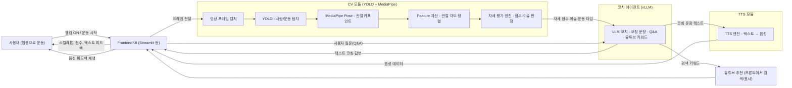

# ai01-2nd-2team-KSLNOVA
The second project of NOVA - **운동 자세 교정 AI Agent**

----------------------------

# 프로젝트 기획서

## 1. 프로젝트 정의
- **프로젝트 이름(가칭)** : 운동 자세 AI Agent
- **프로젝트 목표**
  - 웹캠으로 촬영한 사용자의 운동 자세를 실시간으로 인식하고,
    - YOLO + MediaPipe로 **자세를 감지/분석**하고
    - LLM 기반 코치가 **텍스트/음성 피드백**을 제공하며
    - 운동 관련 **Q&A 및 유튜브 추천 영상**까지 연계하는
    - **실시간 운동 자세 교정 AI Agent**를 구현한다.

- **참고 논문**
  - MediaPipe 기반 운동자세 교정 시스템의 기능 개선 연구  
  - YOLOv8과 Mediapipe를 이용한 운동자세 교정 자동 피드백 시스템  
  - 실시간 동작 인식 및 자세 교정 스마트 미러 피트니스 시스템 

## 2. 주요 내용
- **프로젝트 기간**: 2025-12-02 ~ 2025-12-10
- **팀원 소개**

|        | 김채원 | 손지원 | 이주연 | 이진배 |
|--------|--------|--------|--------|--------|
| 사진   | 

 | 

 | 

 | 

 |
| 역할   | TTS / 팀장 | UI | CV | LLM |
| 담당 모듈 | 자세 스코어링, TTS 엔진 선정, 텍스트→음성 변환 | 웹 UI, 웹캠 | YOLO / MediaPipe, 관절 각도 계산 | vLLM 세팅, 코칭/Q&A 프롬프트, 유튜브 추천 키워드 |

## 3. 일정 계획
![일정표]

| 작업 항목                  | 시작 날짜   | 종료 날짜   | 기간(일) |
|---------------------------|------------|------------|---------|
| 아이디어 회의               | 2025-12-02 | 2025-12-04 | 3       |
| 미정                       | 2025-01-08 | 2025-01-14 | 7       |
| 미정                       | 2025-01-15 | 2025-01-21 | 7       |
| 미정                       | 2025-01-22 | 2025-01-28 | 7       |
| 미정                       | 2025-01-29 | 2025-02-04 | 7       |
| 미정                       | 2025-02-05 | 2025-02-07 | 3       |
| 프로젝트 발표               | 2025-12-10 | 2025-12-10 | 1       |

-----------------------------

# 작업 분할 구조 (WBS)

## 1. 기능 단위 WBS (1차 버전)

### 1. CV 모듈 (YOLO + MediaPipe)

- 1.1 웹캠/영상 입력 파이프라인 구현  
- 1.2 YOLO 기반 사람/운동 영역 탐지 코드 작성  
- 1.3 MediaPipe Pose 기반 관절 좌표 추출  
- 1.4 관절 각도 계산 유틸 함수 구현  
- 1.5 운동별 (푸쉬업, 스쿼트) 기본 자세 기준 룰 정의  
- 1.6 자세 스코어링 및 상태 분류 (좋음/보통/나쁨 등)

### 2. TTS 피드백 모듈

- 2.1 TTS 엔진 후보 조사 및 선정  
- 2.2 텍스트 → 음성 변환 함수 구현  
- 2.3 Frontend와 음성 재생 연동 (재생/정지 버튼, 자동 재생 여부)

### 3. LLM 코치 & Q&A 모듈 (vLLM)

- 3.1 vLLM 환경 세팅 및 로컬 서버 실행  
- 3.2 코칭 프롬프트 템플릿 설계  
  - 입력: 운동 종류, 자세 점수, 문제 부위, 세트/반복 수 등  
- 3.3 실시간 코칭 문장 생성 API 구현  
- 3.4 운동 관련 Q&A 처리 API 구현  
- 3.5 유튜브 검색 키워드/문장 생성 기능

### 4. Frontend(UI)

- 4.1 UI 와이어프레임 설계  
- 4.2 웹캠 영상 스트리밍 + skeleton 오버레이  
- 4.3 자세 점수/상태 게이지 및 알림 영역  
- 4.4 LLM 텍스트 피드백 패널 및 음성 제어 버튼  
- 4.5 유튜브 추천 영상 표시 영역

---------------------------

# 요구사항 정의서

## 1. 기능 요구사항
- [FR-01] 웹캠을 통해 사용자의 운동 자세를 실시간으로 입력받을 수 있어야 한다.  
- [FR-02] 시스템은 YOLO + MediaPipe를 활용해 사람/관절 좌표를 인식해야 한다.  
- [FR-03] 운동별(푸쉬업, 스쿼트 등) 핵심 관절 각도를 계산하여 자세를 평가해야 한다.  
- [FR-04] 사용자의 자세에 대해 **텍스트 피드백**을 제공해야 한다.  
- [FR-05] 사용자의 자세에 대해 **음성(TTS) 피드백**을 제공할 수 있어야 한다.  
- [FR-06] 사용자는 운동 관련 질문을 할 수 있고, LLM 코치가 Q&A를 제공해야 한다.  
- [FR-07] LLM은 사용자의 운동/자세 정보를 참고해 **관련 유튜브 영상 검색 키워드**를 제안해야 한다.

## 2. 비기능 요구사항
- [NFR-01] 지연 시간: 웹캠 입력 → 피드백 출력까지 평균 1~2초 이내를 목표로 한다.  
- [NFR-02] 초기에는 푸쉬업/스쿼트 위주로 구현하되, 추후 동작 추가가 용이하도록 모듈화한다.  
- [NFR-03] 운동 초보자도 이해할 수 있는 한국어 피드백 문장을 우선적으로 제공한다.  
- [NFR-04] 로컬 개발/시연 환경에서 안정적으로 동작하도록 구성한다.

---------------------------

# 프로젝트 설계서

## 1. 시스템 아키텍처
1. **사용자 (클라이언트)**  
   - 브라우저에서 웹캠 ON → 운동 동작 수행

2. **Frontend(UI)**  
   - 웹캠 영상 프레임 캡처  
   - CV 서버로 전송 (또는 로컬에서 바로 처리)  
   - CV/LLM/TTS 결과 수신 후 화면/음성으로 출력

3. **CV 모듈**  
   - YOLO로 사람/운동 영역 탐지  
   - MediaPipe Pose로 관절 키포인트 추출  
   - 각도 계산 + 자세 스코어 산출  
   - 결과(각도, 점수, 문제 부위 등)를 LLM 모듈과 UI로 전달

4. **LLM 코치 모듈 (vLLM)**  
   - 현재 자세 데이터(점수/문제 부위/운동 종류)를 입력으로 받아  
   - 코칭 문장, 추가 설명, 유튜브 검색 키워드 등을 생성  
   - 생성된 텍스트를 UI 및 TTS 모듈에 전달

5. **TTS 모듈**  
   - LLM에서 전달받은 코칭 문장을 음성으로 변환  
   - Frontend로 음성 데이터를 전달하여 재생

## 2. 기술 스택
## 📚 TECH STACKS

  <!-- 1줄 -->
  
  

  <!-- 2줄 -->
  
  

  <!-- 3줄 -->
  
  

## 3. 설계 이미지

---------------------------

# 데이터 연동 정의서

## 1. 데이터 정의
- NONE

## 2. 연동 방식
- NONE

--------------------------

# 클라우드 아키텍처 설계서

## 1. 아키텍처 개요
- **사용 서비스**:
  - NONE

## 2. 설계 이미지
NONE

-------------------------

# 시각화 리포트

## 1. 분석 결과 요약
- NONE

## 2. 대시보드
NONE

## 3. 제안
- NONE

--------------------------

# 프로젝트 회고

## 1. 프로젝트 개요
- **프로젝트 이름**: [프로젝트 명]
- **기간**: [YYYY-MM-DD ~ YYYY-MM-DD]
- **팀 구성원**: [팀원 이름]

---

## 2. 회고 주제
### 2.1. 잘한 점 (What went well)
- NONE

---

### 2.2. 개선이 필요한 점 (What could be improved)
- NONE

---

### 2.3. 배운 점 (Lessons learned)
- NONE

---

### 2.4. 다음 단계 (Action items)
- NONE

---

## 3. 팀원별 피드백
- NONE
---

## 4. 프로젝트 주요 결과 요약
- **성과**:
  - NONE
- **결과물**:
  - NONE

---

## 5. 자유로운 의견
- NONE